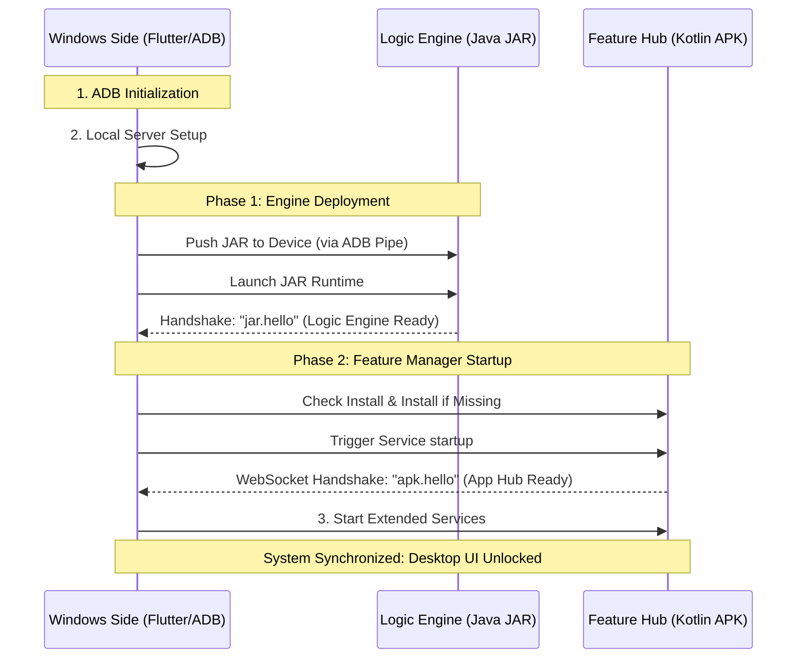

# PhoneDex

Transform your Android device into a desktop experience. Mirror apps, control your phone, stream audio, manage media, launch multiple Android apps, and connect over USB or Wi-Fi — all from Windows or Linux.

## Features

- **Multi-Window Apps**: Each Android app runs in its own resizable, movable desktop window
- **Live Notifications**: Android notifications pushed instantly to your desktop
- **Media Control**: Full artwork, metadata, and playback controls for any media session
- **Live Telemetry**: Real-time battery, volume, Wi-Fi, Bluetooth, and device states
- **Low Latency**: Shell-level commands bypass UI overhead for responsive control
- **Auto-Healing**: Multi-stage reconnection restores connection seamlessly on disconnect
- **Wireless-First**: Works perfectly on wireless devices even on first connect

## Architecture

Three-layer system design:

```
┌────────────────────────────────────────────────────────────────────┐
│                        WINDOWS SIDE                                │
│  Flutter UI · ADB Lifecycle · Server Infrastructure · Scrcpy      │
└────────────────┬──────────────────────────────┬───────────────────┘
                 │ TCP Socket                    │ WebSocket
                 ▼                               ▼
┌────────────────────────┐         ┌─────────────────────────────┐
│   ⚡ Logic Engine      │         │   📱 Feature Hub (APK)      │
│   Java JAR             │         │   Kotlin Service             │
│   ADB Shell Context    │         │   Android System Context     │
└────────────────────────┘         └─────────────────────────────┘
```

Both Android-side components connect back to the Windows side — the Windows app runs the servers; Android clients connect to them.

### Layer 1 — Windows Side (Flutter)
- ADB Lifecycle: Starts ADB server, connects device, sets up reverse port forwarding
- Server Infrastructure: Runs TCP/WebSocket servers that Android components connect to
- JAR Deployment: Locates, pushes, and launches the Logic Engine on the device
- APK Management: Detects, installs, and starts the companion APK service
- Rendering: Embeds scrcpy windows as native child windows inside Flutter
- UI: Boot screen, home screen, app drawer, taskbar, reconnection overlay
- Reconnection: Monitors connection state; auto-heals without user restart
- Device Selection: Auto-detects ADB devices; shows picker dialog when needed

### Layer 2 — Logic Engine (Java JAR)
- Runs with elevated ADB daemon privileges via `adb shell app_process`
- Volume Control: Direct `AudioManager` stream access at shell level
- App Launch: `ActivityManager.startActivity()` with flags for foreground
- App Kill: `ActivityManager.forceStopPackage()`
- Screen Wake/Sleep: `PowerManager` + `WakeManager` invocation

### Layer 3 — Feature Hub (Kotlin APK)
- Runs in Android application context
- Notification Streaming: `NotificationListenerService`
- Media Session: `MediaSessionManager` — title, artist, artwork, state
- Battery Telemetry: `BatteryManager` broadcast receiver
- Device States: Wi-Fi, Bluetooth, Mobile Data, Airplane, Mute, Rotation, Location, Torch

## Quick Start

### Prerequisites
- **OS**: Windows 10+ or Modern Linux (Ubuntu, Fedora, etc.)
- **Device**: Android device running Android 8.0+
- **Drivers**: ADB is bundled — no separate installation needed

### Setup
1. **Enable Developer Options** on your phone
   - `Settings → About Phone` → tap **Build Number** 7 times

2. **Enable USB Debugging**
   - `Settings → Developer Options → USB Debugging → ON`

3. **For Wi-Fi**: Enable Wireless Debugging
   - `Settings → Developer Options → Wireless Debugging → ON`
   - Note the IP address and port

4. **Launch PhoneDex** — watch the boot progress bars fill to 100%

5. **The desktop unlocks** — your Android is now a full desktop experience

## Launch Options

### Windows
| Command | Description |
| :--- | :--- |
| `phonedex.exe` | **Auto-detect** — recommended for most users |
| `phonedex.exe --usb` | Force **USB** connection only |
| `phonedex.exe 192.168.1.100` | Connect via **IP address** |
| `phonedex.exe 192.168.1.100:5555` | Connect via **IP & custom port** |

### Linux
```bash
cd phonedex_linux/
chmod +x run_phonedex.sh
./run_phonedex.sh
```

## The Handshake Protocol

A three-layer cryptographic-style handshake ensures all components are ready before the desktop UI unlocks.



## Reconnection System

Once boot completes, `ReconnectionManager` monitors connection health:

1. **Phase 1 — Quick Reconnect**: Re-establish ADB link and restore TCP/WebSocket connections
2. **Phase 2 — Full Restart** (up to 2 attempts): Re-deploy JAR and re-launch APK service from scratch
3. **Phase: Failed**: Shows permanent error state with disconnect reason

Partial disconnections are handled independently — if only JAR drops, only JAR-related recovery runs.

## Building from Source

```bash
# Clone the repository
git clone https://github.com/iamhero337/PhoneDex.git
cd PhoneDex

# Get dependencies
flutter pub get

# Generate code (if using freezed/json_serializable)
dart run build_runner build --delete-conflicting-outputs

# Run in debug mode
flutter run -d windows

# Build release
flutter build windows --release
```

## Project Structure

```
lib/
├── main.dart                          # App entry point
├── src/
│   ├── core/                          # Core models & app manager
│   │   ├── app_manager.dart           # Master initialization orchestrator
│   │   └── device.dart                # Connection target & device models
│   ├── adb/                           # ADB operations
│   │   └── adb_provider.dart          # ADB binary resolution & commands
│   ├── jar/                           # Logic Engine (JAR) management
│   │   ├── jar_manager.dart           # JAR lifecycle & deployment
│   │   └── jar_server.dart            # TCP server for JAR connections
│   ├── apk/                           # Feature Hub (APK) management
│   │   ├── apk_manager.dart           # APK lifecycle & WebSocket
│   │   └── apk_server.dart            # WebSocket server for APK
│   ├── reconnection/                  # Reconnection system
│   │   └── reconnection_manager.dart  # Auto-healing & recovery
│   ├── state/                         # Centralized state
│   │   └── android_core.dart          # Reactive state store
│   ├── ui/                            # Flutter UI
│   │   ├── boot_screen.dart           # Boot progress & errors
│   │   ├── home_screen.dart           # Desktop experience
│   │   ├── device_picker_dialog.dart  # ADB device selection
│   │   └── about_screen.dart          # About & credits
│   └── utils/
│       └── logger.dart                # Simple logging
```

## Credits

Built with ❤️ by **Hero (@iamhero337)**

### Third-Party Libraries
- [Flutter](https://flutter.dev) - UI Framework
- [scrcpy](https://github.com/Genymobile/scrcpy) - Screen mirroring
- [ADB](https://developer.android.com/studio/command-line/adb) - Android Debug Bridge
- [Riverpod](https://riverpod.dev) - State management
- [WebSocket Channel](https://pub.dev/packages/web_socket_channel) - WebSocket support
- [Window Manager](https://pub.dev/packages/window_manager) - Window controls
- [Bitsdojo Window](https://pub.dev/packages/bitsdojo_window) - Custom title bar

## License

MIT License - see [LICENSE](LICENSE) for details.